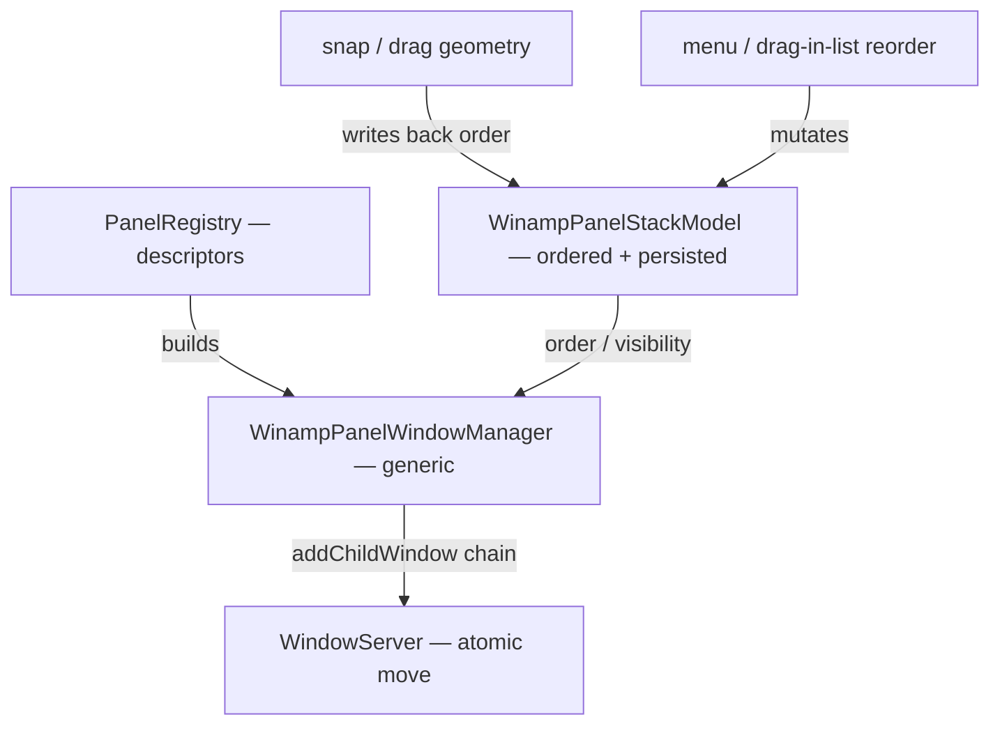

# Windowing System Review — Winamp macOS

> Focused review of the **multi-window / subwindow system**: movement & docking-drag,
> stacking fidelity vs. classic Winamp, resizing, and panel on/off lifecycle.
> Scope: `feature/metal-visualization`. Companion docs: [`ARCHITECTURE_REVIEW.md`](ARCHITECTURE_REVIEW.md)
> (whole-project) and [`CODE_REVIEW.md`](CODE_REVIEW.md) (bug-level).

**Status legend:** ✅ Fixed · 🟡 Partially addressed · ⬜ Not yet done · ℹ️ Design note

---

## Verdict

The **drag model is well designed** — a faithful [Webamp](https://github.com/captbaritone/webamp)
port whose snap/connect geometry is a pure, unit-tested core (`WinampWindowSnap`,
`WinampPanelDocking`). The **stacking and on/off lifecycle are weaker**: the orchestration
layer caches a stale dock anchor (toggling the EQ corrupts the stack), a double-click handler
hijacks windowshade, and the EQ anchor is hardcoded to the main window. The recent
move-to-`NSAnimationContext` refactor also **regressed lockstep dragging** — panels now trail
the main window by ~1 frame. None are crashers; all are visual/UX correctness or fidelity gaps.

> **Update:** W1–W6 are fixed, and **Phase 1 (M1, M2, M4) has landed**. The closed
> `WinampPanelKind` enum is replaced by an open `WinampPanelID` + `WinampPanelDescriptor` registry
> (M1), sizing is descriptor data (M4), and an ordered, persisted `WinampPanelStackModel` is now the
> single source of truth for dock order (M2) — which closed W5 (the EQ can dock anywhere and stay)
> and made W2 structural. The geometry→order resolver is a pure, unit-tested function (partial W9).
> Remaining: **M3** (a user-facing reorder control — drag-snap reorder already persists), **W8**
> (visualizer as a panel), and the rest of W9 (manager-level integration tests).

The recurring root cause behind the drag-lag and the docking gaps is the same: the manager does
**manual per-window frame bookkeeping** instead of using native window grouping
(`addChildWindow`). Adopting parent-child windows collapses several findings into one fix.

**Against the modular goal** — arbitrary, user-reorderable stackable panels with the classic look
preserved — the current design falls short: it is a **two-panel special case**, not an extensible
system. `WinampPanelKind` is a closed enum and the manager switches on it throughout
(`makeEqualizerRoot` / `makePlaylistRoot`, `applyPlaylistContentSize` / `applyEqualizerContentSize`,
per-kind anchor logic); the stack order (`main → EQ → playlist`) is **hardcoded**, with no ordered
model a user could reorder or persist. Adding a third panel today means editing the enum plus ~6
switch sites. The fix is architectural — a **panel registry + an explicit ordered stack model** —
and it subsumes W2/W5/W6/W8. Crucially this is an *internal* refactor: the descriptors carry no
macOS chrome, so the **classic Winamp skin/look is unchanged**.

_Severity `Arch` = architectural/design-level (enables the modular goal), not a runtime bug._

| # | Finding | Severity | Status |
|---|---|---|---|
| M1 | Closed `WinampPanelKind` enum + per-kind switches block new panels | Arch | ✅ |
| M2 | No explicit, ordered, persisted stack model (order is hardcoded) | Arch | ✅ |
| M3 | No user reordering of the stack | Arch | 🟡 |
| M4 | Per-kind sizing/anchor logic should be descriptor data (strategy) | Arch | ✅ |
| W1 | Stack drag lag — panels trail main by ~1 frame (regression) | Important | ✅ |
| W2 | Toggling EQ off leaves a gap; tested anchor fn is bypassed | Important | ✅ |
| W3 | Panel title double-click miniaturizes to Dock, not windowshade | Important | ✅ |
| W4 | Main window is resizable (should be fixed-size skin) | Important | ✅ |
| W5 | EQ dock anchor hardcoded to main window | Important | ✅ |
| W6 | Dragging a panel strands windows docked beneath it | Important | ✅ |
| W7 | Playlist resize was vertical-only (now both axes; no 25px increments) | Suggestion | 🟡 |
| W8 | Visualizer is an inline view, not a managed window | Suggestion | ⬜ |
| W9 | Stateful window-manager orchestration is untested | Suggestion | 🟡 |

---

## Architecture map

Three distinct windowing mechanisms coexist:

1. **Main `NSWindow`** — created by SwiftUI/`WindowGroup`, chrome applied in
   `ContentView.configureWindow` → `WinampWindowConfigurator.apply`.
2. **Managed panel `NSWindow`s** (EQ, playlist) — owned by `WinampPanelWindowManager`, a
   `@MainActor` singleton. Visibility, sizing, docking, and drag all flow through here.
3. **Inline visualizer view** — `MilkdropVisualizerView` glued into the main window's `HStack`
   (`ContentView`), not a window at all (see W8).

| Layer | File | Responsibility |
|---|---|---|
| Orchestration | `Sources/WinampPanelWindowManager.swift` | AppKit window lifecycle, drag loop, dock state |
| Panel registry (data) | `Sources/WinampPanelDescriptor.swift` | `WinampPanelID` (open set) + `WinampPanelDescriptor` + `PanelSizingPolicy` |
| Stack model + resolver | `Sources/WinampPanelStackModel.swift` | persisted dock order (source of truth) + pure geometry→order resolver |
| Snap geometry (pure) | `Sources/Utilities/WinampWindowSnap.swift` | `abuts` / `traceConnected` / `snappedOrigin` — Webamp port |
| Window chrome | `Sources/Utilities/WinampWindowConfigurator.swift` | borderless style mask, hidden traffic lights |
| Layout state | `Sources/WinampPanelLayoutState.swift` | `showEqualizer` / `showPlaylist` / `isShadeMode` / playlist size |
| Drag handle | `Sources/Views/Player/PlayerWindowChrome.swift` | `DraggableWindowView.mouseDown` → `startDrag` |
| Toggle wiring | `Sources/ContentView.swift` | `onChange` → `syncPanels` / `resizePlaylistPanel` |
| Resize handle | `Sources/PlaylistView.swift` | `ResizeHandle` bottom-edge `DragGesture` |

---

## Modularity & extensibility (architecture)

> Goal: support **arbitrary stackable panels** added over time, **user-reorderable**, with the
> **classic Winamp look preserved**. Today's code is a two-panel special case; a small set of seams
> makes it open-ended. This is an *internal* refactor — the rendered chrome is identical.

**Design-pattern targets:** Registry (panel descriptors), Strategy (sizing policy as data), ordered
chain / Composite (the stack), Memento (persisted order), Coordinator (the manager stays the only
AppKit orchestrator). The closed enum + per-kind `switch` is an **Open/Closed** violation; the seams
below remove it so new panels are *added*, never *edited in*.

### Target design



**1 — Panel descriptor (Registry, replaces the enum).**
```swift
struct WinampPanelDescriptor: Identifiable {
    let id: WinampPanelID                  // stable string id (open set), not a closed enum
    let title: String
    let sizing: PanelSizingPolicy
    let defaultStackIndex: Int             // initial top→bottom position
    let makeRoot: @MainActor () -> AnyView // classic chrome applied *inside*
}

enum PanelSizingPolicy {                       // Strategy — replaces per-kind switches
    case fixedToContent                        // main, EQ  (encodes W4 declaratively)
    case resizable(minWidth: CGFloat, minHeight: CGFloat) // playlist, both axes (W7)
}
```
Adding a panel = register one descriptor; the manager never changes.

**2 — Explicit ordered stack model (source of truth, persisted).**
```swift
@MainActor final class WinampPanelStackModel: ObservableObject {
    @Published private(set) var order: [WinampPanelID]   // docked order, top→bottom
    @Published var visible: Set<WinampPanelID>
    @Published var floating: Set<WinampPanelID>
    func move(_ id: WinampPanelID, to index: Int)        // user reorder
    // Codable → UserDefaults: order + visibility survive restart (Memento)
}
```
Replaces the hardcoded `main → EQ → playlist` and demotes the geometry-derived `dockedBelow` to a
*cache* of the model rather than the source of truth.

**3 — Generic stacking.** `stackDockedPanels()` iterates `stackModel.order`, placing each visible,
docked panel below its predecessor and sizing it via `descriptor.sizing`. The per-kind methods
(`applyPlaylistContentSize`, `defaultPlaylistAnchor`, the EQ special-case, `WinampPanelDocking`)
collapse into one loop over the ordered model.

**4 — Atomic movement + reorder via parent-child windows (Fix A).** Build the `addChildWindow`
chain from `stackModel.order`; reordering rebuilds the chain. The WindowServer then moves the stack
atomically (fixes W1) and carries sub-trees (fixes W6).

**Reordering UX (two writers, one model).**
- *Authentic drag-snap* (geometry) writes the resulting order back into `stackModel` — the Winamp
  feel stays the interaction; the model is just the memory.
- *Explicit reorder* (a View-menu entry, or drag within a small "windows" list) calls
  `stackModel.move(...)`. Both paths persist.

**Look & feel preserved.** Descriptors hold no macOS chrome; each root keeps `winampOuterFrame()`
+ the classic title bar. Modularity is purely structural — the pixels are identical.

**Scope note (don't over-build).** Model the **linear vertical stack** the user asked for. Winamp's
full 2D side-docking (a branching tree across left/right edges) is a larger graph problem; the
registry + descriptor approach still holds, but keep the ordered model 1-D until side-docking is an
actual goal.

### M1 — Closed `WinampPanelKind` enum + per-kind switches  ✅
The enum (`.equalizer`, `.playlist`) plus the ~6 `switch`/per-kind methods hard-bound the system to
exactly two panels.

**Fixed:** new `Sources/WinampPanelDescriptor.swift` introduces `WinampPanelID` (a `String`-backed
struct — an *open* set; new panels declare their own constant without editing a central enum) and
`WinampPanelDescriptor` (`id` + `isVisible` + `makeRoot` + `sizing`). The manager holds a `registry:
[WinampPanelDescriptor]` (built once, closures read live `layoutState` through `self`) and iterates
it: `syncPanels` loops descriptors and shows/hides by `descriptor.isVisible()`; `showPanel` builds
the hosting controller from `descriptor.makeRoot()`; every `WinampPanelKind.allCases` loop is now
`for id in panelIDs`, and the dictionaries re-key to `WinampPanelID`. The bespoke `makeEqualizerRoot`
/ `makePlaylistRoot` methods are gone. `WinampPanelKind.swift` is deleted. Adding a panel
(e.g. the visualizer, W8) is now “append a descriptor.”

*Scope:* docking *order/anchoring* (`stackDockedPanels`, `defaultPlaylistAnchor`, `setDefaultDockParent`)
still references `.equalizer` / `.playlist` explicitly — generalizing that into an ordered model is
M2. Verified: full suite `TEST SUCCEEDED`; rendered look unchanged (descriptors carry no chrome).

### M2 — No explicit, ordered, persisted stack model  ✅
Dock order used to be implicit — recomputed from geometry into a `dockedBelow` cache, with the
two-panel arrangement hardcoded across `stackDockedPanels` / `defaultPlaylistAnchor` /
`setDefaultDockParent` / `applySnapIfNeeded`.

**Fixed:** new `Sources/WinampPanelStackModel.swift` introduces `WinampPanelStackModel` — an
ordered `order: [WinampPanelID]` + `floating` set, the **single source of truth**, with the order
persisted to `UserDefaults` (a new panel slots in at its registry position; a removed one drops out).
The data flow inverts from *geometry → layout* to *geometry → model → layout*:
- `stackDockedPanels` is now **one generic loop** over `model.dockedStack(visible:)` — each panel
  flush below its predecessor, the first below main. The EQ/playlist `if` blocks are gone.
- `dockAnchorWindow` derives the anchor from `model.anchorAbove(of:visible:)` instead of the cache.
- On drag-end, `refreshDockState` resolves order + floating from window frames via the pure
  `WinampPanelStackResolver` and writes them back to the model; `stackDockedPanels` then snaps every
  docked panel flush (so the old `applySnapIfNeeded` pass is deleted).
- `dockedBelow`, `isFloating` (dict), `defaultPlaylistAnchor`, `setDefaultDockParent`,
  `reanchorDockedPlaylist`, `anchorAbove`, and `applySnapIfNeeded` are all removed; `WinampPanelDocking`
  is deleted (superseded).

W2 is now **structural** (hiding the EQ leaves only the playlist visible, which the generic loop
docks below main — no gap) and **W5 falls out** (see below). Scope: 1-D vertical stack and
*drag-snap* reordering only — an explicit reorder UI is M3. Verified: 10 new `WinampPanelStackTests`
(resolver + model + persistence) pass; full suite green.

### M3 — No user reordering  🟡
With M2 in place, **drag-snap reordering already works and persists** — dropping the EQ below the
playlist is recorded in `model.order` and survives restart. What's left is an *explicit* control
(a View-menu entry or a small windows list) for users who'd rather not drag; that is the remaining
M3 surface. The model intentionally exposes only the drag-snap write path for now (per scope
decision), so adding `move(_:to:)` + a menu is a small follow-up.

### M4 — Per-kind sizing/anchor logic should be descriptor data  ✅
The **sizing** half landed with M1: `sizePanelWindow` / `applyPlaylistContentSize` /
`applyEqualizerContentSize` collapsed into one `applyContentSize(for:)` driven by
`descriptor.sizing` (`PanelSizingPolicy`: `.fixedToContent` for EQ, `.explicit` for the playlist).
The **anchor** half closed with M2: `defaultPlaylistAnchor` / `setDefaultDockParent` and the
`WinampPanelDocking` special-case are deleted; anchoring is resolved generically from the ordered
stack model. No per-kind sizing/anchor control flow remains.

---

## Important

### W1 — Stack drag lag: panels trail the main window  ✅
There is only **one** movement path during a drag — main and panels both route through
`DraggableWindowView.mouseDown` → `startDrag(leading:)`, and (previously) `handleDragMoved()` moved
every connected window in a loop. The lag was **not** two competing systems; it was that each
window was committed in a **separate, non-atomic** frame update — `setFrameOriginWithoutAnimation`
wrapped each move in its own `NSAnimationContext.runAnimationGroup`, giving every window its own
commit boundary, so they landed in different screen-refresh cycles and the panels trailed the lead
by ~1 frame. (The recent diff introduced this by swapping a bare `setFrameOrigin` for the
animation-group wrapper — correct for resize, wrong for drag.)

**Fixed via Fix A — native window grouping.** Docked panels are now attached as **child windows**
of the window they dock beneath (`syncChildWindowLinks()` mirrors the `dockedBelow` graph onto
`addChildWindow`/`removeChildWindow`, called at the end of every `stackDockedPanels()` pass). The
drag loop moves **only the lead** (`ActiveDrag` shrank to `lead` + `startOrigin`); the WindowServer
repositions the children with their parent, so the whole stack moves **atomically** — zero per-window
lag. `movingWindows(for:)` and the per-window origin bookkeeping are gone.

Supporting changes so the child links stay correct:
- `startDrag` detaches the grabbed window from its parent (it moves freely; its own children — the
  sub-tree below — stay attached and follow). → also delivers W6.
- `refreshDockState` is now **sub-tree-aware**: a panel docks to whatever window directly abuts it
  *from above* (which may itself be a floating panel), instead of only recognizing windows still
  connected to the main player — so a detached EQ+playlist pair stays linked and moves together.
- `hidePanel` and `handleMainMiniaturized` **detach children before ordering out**, because
  ordering out a parent also hides its child windows (which would otherwise wrongly hide a panel
  docked below the one being hidden); re-anchoring + `syncChildWindowLinks` re-attaches any orphan.

Verified: full suite `TEST SUCCEEDED`; build + relaunch clean. Manager-level drag/dock tests remain
deferred with W9 (the singleton holds live `NSWindow`s).

### W2 — Toggling the EQ off leaves a gap; the tested anchor fn is bypassed  ✅
`WinampPanelDocking.playlistAnchor` correctly returns `.main` when the EQ is hidden — and it is
unit-tested (`WinampPanelDockingTests`). But the manager only consults it **once**, at panel
creation, in `setDefaultDockParent`. Runtime stacking instead reads the cached
`dockedBelow[.playlist]` via `dockAnchorWindow(for:)`, which returns the EQ window **even after it
is hidden** (it filters by identity, not `isVisible`).

Repro: launch (stack = main → EQ → playlist), then toggle EQ off. `syncPanels()` re-runs but never
re-anchors the playlist, so `positionPanel` places it below the now-invisible EQ frame → an
EQ-height gap opens under the main window instead of the playlist sliding up.

**Fixed:** `syncPanels()` now calls a new `reanchorDockedPlaylist()` before `stackDockedPanels()`,
which re-runs `defaultPlaylistAnchor()` (→ the tested `WinampPanelDocking.playlistAnchor`) for the
docked playlist and refreshes the `dockedBelow` cache. A floating playlist is left untouched.
Regression test `testPlaylistAnchorsToMainWhenEqualizerHiddenButStillDocked` locks the
previously-untested visible-gating branch the fix relies on (`docked && !visible → .main`).

### W3 — Double-clicking a panel title bar miniaturizes to the Dock  ✅
`DraggableWindowView.mouseDown` calls `window.performMiniaturize(nil)` on `clickCount == 2`.
Because the drag overlay sits on top of the SwiftUI header, it **shadows** the playlist's
`.onTapGesture(count: 2)` roll-up. Result: double-clicking the EQ/playlist title sends the window
to the Dock — the opposite of Winamp, where title double-click = **windowshade** (roll up to the
title bar). The same handler also makes the **main** window miniaturize on title double-click
rather than shade.

**Fixed:** the double-click branch now calls `WinampPanelWindowManager.toggleWindowshade(for:)`
(symmetric with how `startDrag` already routes through the manager — the Coordinator owns chrome
actions). It maps the playlist → `playlistMinimized`, the main window → `isShadeMode`, and the EQ →
no-op (this app has no EQ windowshade state, so doing nothing is strictly better than the Dock
behavior). The playlist's previously-shadowed `.onTapGesture(count: 2)` is now effectively restored
through the single NSView path, so there is no double-toggle. Manager-level coverage is deferred
with W9 (the singleton holds live `NSWindow`s); the routing is a 3-way window-identity branch.

Because the toggle fires from an AppKit `mouseDown` (outside SwiftUI's transaction), ContentView's
`.onChange(of: playlistMinimized) → resizePlaylistPanel()` resizes the NSWindow frame, but the
**panel's SwiftUI content did not reflow** with the click — it only snapped into place when an
unrelated relayout (e.g. moving the stack) forced the hosting view to re-evaluate. Root cause: the
detached panel runs in its own `NSHostingController` whose `decoratedView` injects `audioPlayer` /
`playlistManager` / `uiScale` but **not `layoutState`**, so `PlaylistView` held only a `Binding` to
`playlistMinimized` and never *observed* it. The window shrank while the content kept its stale
explicit `.frame(height:)` and was merely clipped.

**Refresh fix:** `makePlaylistRoot` now wraps the panel in `PlaylistPanelRoot`, which holds
`layoutState` as an `@ObservedObject`. Any `playlistMinimized` / `playlistSize` change re-renders
the panel body immediately, so the windowshade reflows in lockstep with the click (and with the
NSWindow frame). This also fixes the same latent staleness for the in-panel chevron and any future
external mutation of panel layout state.

> **Fidelity gap (follow-up):** the EQ no-op is correct for the current model but classic Winamp's
> EQ *can* windowshade. Adding it is a small feature — an `equalizerMinimized` state + a shaded EQ
> layout + window sizing — not just wiring, so it is intentionally out of W3's scope.

### W4 — Main window is resizable (should be a fixed-size skin)  ✅
Per project intent, **only the playlist resizes**; the main player and EQ are fixed-size skins.
`ContentView.configureWindow` called `WinampWindowConfigurator.apply(to:)` with the default
`resizable: true`, so `.resizable` landed in the main window's style mask. Its content is
`.fixedSize()` via `winampOuterFrame()`, but AppKit still let the user drag the window
edges/corners, producing a frame larger than the skin with empty filler.

**Fixed:** `configureWindow` now passes `resizable: false`. Programmatic sizing (visualizer-widen,
shade mode, scale changes) is unaffected — `.resizable` only governs user edge-drag, and the
`NSHostingController` resizes the window to fit `.fixedSize()` content regardless. The EQ panel was
already created `resizable: false`; the playlist window likewise is non-resizable at the AppKit
level — its resize is driven by SwiftUI content size, not window-edge dragging (see W7).

### W5 — EQ dock anchor is hardcoded to the main window  ✅
`stackDockedPanels` always positioned the EQ `below: mainWindow`, and `applySnapIfNeeded`
unconditionally reset `dockedBelow[.equalizer]` to the main window, so a user-snapped EQ-under-
playlist arrangement was yanked back every stack pass.

**Fixed by M2.** Order now lives in `WinampPanelStackModel`, and the generic `stackDockedPanels`
loop honors whatever order the drag-snap resolver recorded — including the EQ below the playlist.
The `applySnapIfNeeded` EQ-reset is deleted. Locked by `testResolveHonorsPlaylistAboveEqualizer`.

### W6 — Dragging a panel strands windows docked beneath it  ✅
Previously `movingWindows(for:)` returned `[lead]` for any non-main window, so dragging the EQ moved
only the EQ and left a playlist docked below it behind. In Winamp/Webamp, dragging a window carries
its **sub-tree** (everything docked below) while detaching from windows above.

**Fixed as part of Fix A (W1).** Because docked panels are AppKit child windows, the sub-tree falls
out for free: `startDrag` detaches the grabbed window from its *parent* (so it leaves the windows
above) but keeps its *children* attached, and `handleDragMoved` moves only the lead — the
WindowServer carries the children with it. Dragging the EQ now takes the playlist with it; releasing
re-evaluates dock state via the sub-tree-aware `refreshDockState`.

---

## Suggestions

### W7 — Playlist resize: now both axes (25px increments still TODO)  🟡
`ResizeHandle` resizes via SwiftUI content size. It was **vertical-only**, with width locked to the
scaled panel. Classic Winamp resizes the playlist in **both** axes (in 25px increments).

**Done:** horizontal resize is now supported. `ResizeHandle` maps drag `translation.width` →
width and `translation.height` → height, clamped to `minWidth = WinampMetrics.panelWidth * uiScale`
(never narrower than the docking anchor) and `minHeight = 150`. The bottom-right corner shows the
classic diagonal grip. Width is decoupled from the UI scale: `WinampPanelLayoutState` owns and
persists `playlistSize.width` (new `playlistWidth` default), `ensureMinimumPlaylistWidth(_:)`
replaces the old width-locking `setPlaylistWidth` (it only grows the playlist to the new minimum on
scale change, never shrinking a user-widened one), and `applyPlaylistContentSize` sources the window
width from `playlistSize.width`. A docked playlist wider than the main window extends to the right
and stays snap-connected (left edges remain aligned).

**Remaining (low priority):** 25px increment snapping is not implemented; resize is continuous.
A practical upper clamp could also be added so the window can't grow past the screen.

### W8 — Visualizer is an inline view, not a managed window  ⬜
The Milkdrop visualizer is an inline SwiftUI view in the main window's `HStack` (`ContentView`), so
enabling it widens the main window by 600px rather than opening a dockable window. This is the
**proof case for the modular refactor**: in the target design the visualizer is just another
registered `WinampPanelDescriptor` (M1) that joins the ordered stack (M2) — no `WinampPanelKind`
edit, no manager changes. Until then it stays a one-off.

### W9 — Stateful window-manager orchestration is untested  🟡
The pure geometry (`WinampWindowSnap`) was already covered. **M2 added a pure, injectable seam:**
`WinampPanelStackResolver` (geometry→order) and `WinampPanelStackModel` (order + persistence) are
unit-tested without live `NSWindow`s — the ordering/floating logic that drives docking is now locked
down (10 tests in `WinampPanelStackTests`). What remains uncovered is the thin AppKit wiring inside
the manager (window creation, child-window links, drag monitor) — genuinely needs a UI/integration
harness, so it stays deferred.

---

## Strengths

- **Drag model is faithful and well-attributed.** The connected-window cluster drag is a clean
  Webamp port with source links in the doc comment; delta math off `NSEvent.mouseLocation` over a
  `.leftMouseDragged` / `.leftMouseUp` local monitor is the right approach, and disabling
  `isMovableByWindowBackground` correctly stops AppKit from fighting it.
- **Good seam separation.** Snap math and the docking decision are pure and testable; the manager
  handles only AppKit orchestration; chrome lives in its own files.
- **The recent diff is a net improvement.** Splitting `syncPanels()` into `resizePlaylistPanel()`,
  keeping the live SwiftUI tree instead of rebuilding it, and `flexibleVertical` on the outer frame
  all reduce flicker during playlist resize. (It did regress drag lockstep — W1 — but the resize
  path is better.)
- **Sensible lifecycle touches:** main-window miniaturize orders panels out
  (`handleMainMiniaturized`), EQ visibility is coupled to shade mode via `isEqualizerDocked`, and
  playlist height is persisted to `UserDefaults`.

---

## Recommended action

**Phase 0 — tactical fixes (small, low-risk, ship now):**
1. **W2** ✅ — re-anchor playlist in `syncPanels` on EQ toggle (activates already-tested code).
2. **W3** ✅ — panel double-click → windowshade, not Dock.
3. **W4** ✅ — main window `resizable: false`.
4. **W1** ✅ + **W6** ✅ — **Fix A (native parent-child windows)**, not the stopgap. Docked panels
   are child windows; the stack moves atomically and a dragged panel carries its sub-tree.

**Phase 1 — modular core (unlocks the stated goal):**
5. **M1** ✅ — `WinampPanelDescriptor` + registry; the `WinampPanelKind` switches are retired.
6. **M2** ✅ — `WinampPanelStackModel` (ordered, persisted) is the single source of truth;
   `dockedBelow` is gone, `stackDockedPanels` is a generic loop. *Closed W5; made W2 structural.*
7. **M4** ✅ — sizing folded into `PanelSizingPolicy`; anchor special-cases removed with M2.
8. **M3** 🟡 — drag-snap reorder persists today; an explicit reorder control is the remaining surface.

**Phase 2 — native grouping & fidelity:**
9. **Fix A — parent-child windows** ✅ landed early (see W1/W6); the child-window chain is built from
   the manager's dock anchors, which now derive from `stackModel`.
10. **W8** — register the visualizer as a panel (now genuinely "append a descriptor").

**Backlog:** W7 (25px increment snapping + screen-bound clamp), W9 (manager-level tests so stacking
regressions can't silently return — extract the stack model as a pure, injectable type to make this
cheap).

**Sequencing rationale.** W1/W2/W5/W6 all trace to one root cause — implicit, hardcoded order +
manual frame bookkeeping instead of a model-driven, natively-grouped stack. Phase 0 buys correctness
cheaply; Phases 1–2 deliver the modular, reorderable system without ever touching the skin.
